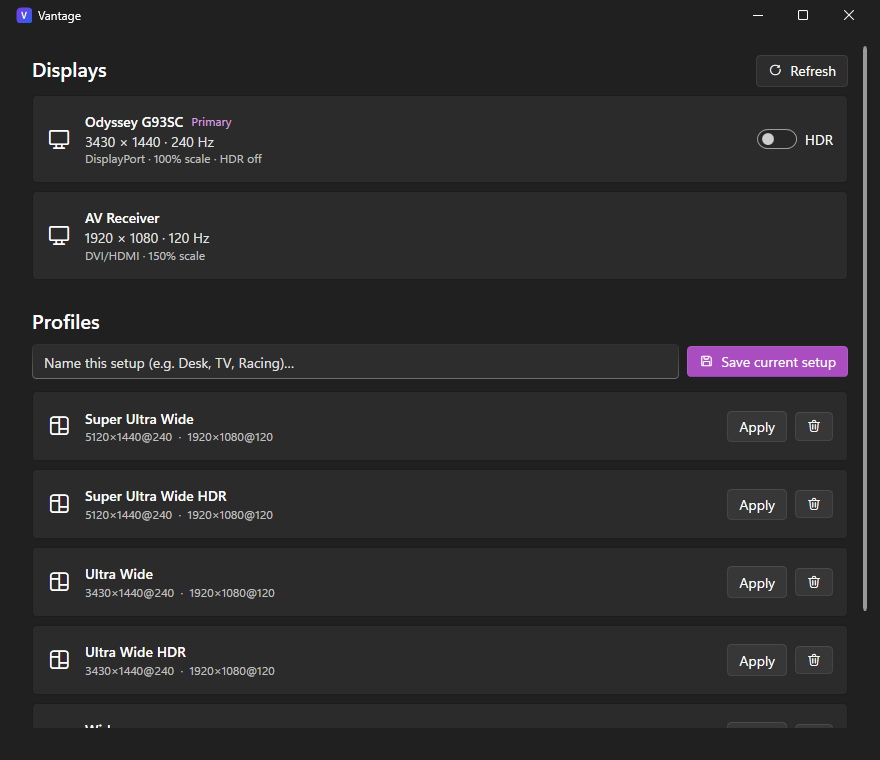

<div align="center">


# Vantage: Display Manager

**Display profiles for Windows 11 that actually stick.**
Save complete display setups — layout, resolution, refresh rate, HDR, scaling — and switch
between them in one click, from the tray, or from a script.

[](https://github.com/inakizamores/vantagedisplaymanager/releases/latest)
[](https://github.com/inakizamores/vantagedisplaymanager/releases)
[](LICENSE)




</div>

---

## Why Vantage?

Tools like HeliosDisplayManagement and DisplayMagician pioneered display profiles on Windows —
and taught everyone the failure modes: profiles that break after every driver update, switches
that hang for 30 seconds, monitors that lose their identity when replugged. Vantage was
designed from a [deep study of those codebases](docs/BLUEPRINT.md) to keep the good ideas and
engineer out the quirks:

| | Vantage |
|---|---|
| 🪟 **Native Windows 11** | Real OS window frame, Mica, your exact accent palette from Personalization — no foreign-looking UI |
| 🧬 **Profiles that survive** | Monitors identified by EDID serial, not session-scoped IDs — profiles survive reboots, driver updates, and port swaps |
| ✅ **Verified switching** | Every change is validated first, applied, then re-read back from Windows and confirmed — never "fire and hope" |
| ⏪ **15-second auto-revert** | A bad switch can never strand you on a black screen |
| 🎚️ **HDR done right** | Windows 11 24H2 HDR API with automatic legacy fallback; SDR white level as a first-class setting |
| 🧩 **Presets without Settings** | Create resolution/refresh/HDR variants of your setup directly — no round-trip through Windows Settings |
| ⌨️ **Fully scriptable** | The `vantagectl` CLI mirrors everything the app does, with JSON output and meaningful exit codes |
| 🫥 **Tray-first** | Instant start, lives quietly in the tray, profiles one right-click away |

## Install

**[⬇ Download the latest release](https://github.com/inakizamores/vantagedisplaymanager/releases/latest)**

| File | For |
|---|---|
| `Vantage-Setup.exe` | **Recommended.** Installs per-user (no admin), Start Menu shortcut, updates cleanly |
| `Vantage-<version>-win-x64-portable.zip` | No install: unzip anywhere and run `Vantage.exe`. Fully self-contained — no .NET required |
| `Vantage-<version>-win-x64-lite.zip` | Small download if you already have the [.NET 8 Desktop Runtime](https://dotnet.microsoft.com/download/dotnet/8.0) |

> **SmartScreen note (beta):** binaries are not yet code-signed, so Windows may show
> "Windows protected your PC" on first run. Click **More info → Run anyway**. Code signing is
> planned via SignPath for open-source projects.

**Requirements:** Windows 10 20H2+ (Windows 11 recommended — HDR features use the 24H2 APIs
when available). x64. No administrator rights needed, ever.

## Quick start

1. Arrange your displays the way you like (Vantage window or Windows Settings — either works).
2. Open Vantage → type a name → **Save current setup**.
3. Want a variant (same layout, different resolution or HDR)? Use the CLI for now:

```bash
vantagectl variant "Ultra Wide HDR" --display 0 --res 3430x1440 --hz 240 --hdr on
```

4. Switch from the app, the tray menu, or a script — every apply is verified, and the app
   offers a 15-second revert window.

### CLI

```text
vantagectl list                  Show connected displays and their full state
vantagectl capture <name>        Save the current configuration as a profile
vantagectl apply <name>          Apply a profile (validated + verified)
vantagectl active                Which profile matches right now?
vantagectl profiles              List profiles with active/available status
vantagectl hdr on|off [n]        Toggle HDR on all capable displays, or one
vantagectl modes [n]             Supported resolutions/refresh rates per display
vantagectl variant …             Create a preset variant of the current setup
```

Add `--json` to `list`, `profiles`, or `active` for machine-readable output.

## How it works

The engine is built on the Windows CCD API (`QueryDisplayConfig` / `SetDisplayConfig`) with a
normalized, versioned profile schema on top:

- **Identity** — monitors are keyed by EDID vendor + product + serial read from the PnP
  registry, with instance-ID fallback. Adapter LUIDs (which change every boot) are re-mapped
  by adapter device path at apply time.
- **Matching** — "is this profile active?" is a per-field semantic comparison with explicit
  tolerances, never a raw struct comparison. A profile mismatch tells you *what* differs.
- **Applying** — validate (`SDC_VALIDATE`) → apply → event/poll settle with deadline →
  per-display DPI/HDR/SDR-white with verify-by-re-query → final re-capture and match.
  When the same displays stay active, the topology replay is skipped entirely and modes are
  reconciled in a single staged desktop transition.

The full design — including the research on DisplayMagician, Helios, Monitorian, twinkle-tray,
HDRTray, and friends that informed it — lives in [docs/BLUEPRINT.md](docs/BLUEPRINT.md) and
[docs/research/](docs/research/).

## Building from source

```bash
git clone https://github.com/inakizamores/vantagedisplaymanager.git
cd vantagedisplaymanager
dotnet build Vantage.sln
```

Requires the .NET 8 SDK. `src/Vantage.App` is the WPF app, `src/Vantage.Cli` the CLI,
`src/Vantage.Core` the engine, `src/Vantage.Interop` the hand-written Win32/CCD layer.

## Roadmap

- **M2** — in-app preset editor, hotkeys, DDC/CI brightness + monitor input switching, visual layout editor
- **M3** — automation: per-app profiles (HDR on when your game launches, revert on exit), time-of-day rules
- **M4** — NVIDIA Surround / AMD Eyefinity, 10-bit color depth control
- **Later** — window layout restore, per-profile wallpaper/audio, winget package, code signing

## Credits

Vantage stands on the shoulders of open-source pioneers:
[HeliosDisplayManagement](https://github.com/falahati/HeliosDisplayManagement) ·
[DisplayMagician](https://github.com/terrymacdonald/DisplayMagician) ·
[Monitorian](https://github.com/emoacht/Monitorian) ·
[twinkle-tray](https://github.com/xanderfrangos/twinkle-tray) ·
[HDRTray](https://github.com/res2k/HDRTray) ·
[AutoActions](https://github.com/Codectory/AutoActions) ·
[LittleBigMouse](https://github.com/mgth/LittleBigMouse) ·
[SetDPI](https://github.com/imniko/SetDPI) ·
[WPF-UI](https://github.com/lepoco/wpfui) ·
[H.NotifyIcon](https://github.com/HavenDV/H.NotifyIcon)

## License

[MIT](LICENSE) © 2026 Iñaki Zamores
