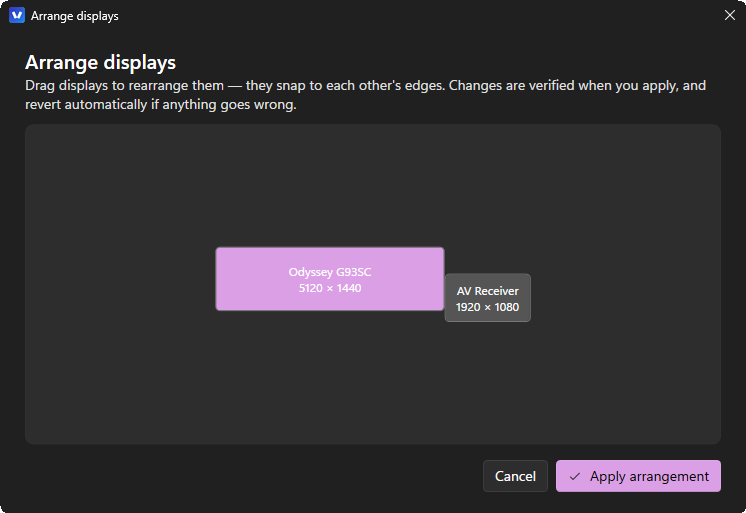
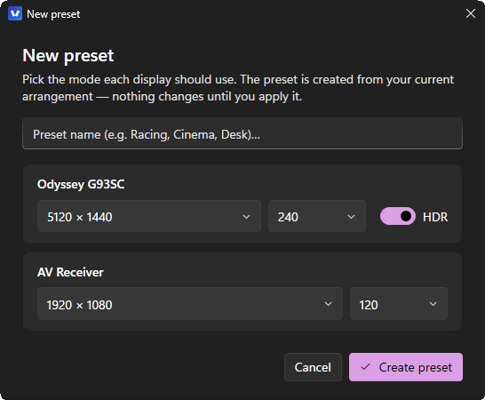

<div align="center">

<picture>
  <source media="(prefers-color-scheme: dark)" srcset="docs/assets/vantage-lockup-dark.png">
  
</picture>

### Display profiles for Windows 11 that actually stick.

Save a complete display setup — layout, resolution, refresh rate, HDR, color depth, scaling —
and switch back to it in one click, one hotkey, or one scripted command.
Every switch is verified, and reverts itself if it fails.

<br />

[](https://github.com/inakizamores/vantagedisplaymanager/actions/workflows/ci.yml)
[](https://github.com/inakizamores/vantagedisplaymanager/releases)
[](https://github.com/inakizamores/vantagedisplaymanager/releases)
[](LICENSE)


<br />


**[⬇ Download](https://github.com/inakizamores/vantagedisplaymanager/releases)** ·
[Quick start](#quick-start) ·
[CLI](#cli) ·
[How it works](#how-it-works) ·
[Roadmap](#roadmap)

</div>

---

## Why Vantage

Tools like HeliosDisplayManagement and DisplayMagician pioneered display profiles on Windows —
and taught everyone the failure modes: profiles that break after every driver update, switches
that hang for 30 seconds, monitors that lose their identity when replugged. Vantage was
designed from a [deep study of those codebases](docs/BLUEPRINT.md) to keep the good ideas and
engineer out the quirks.

The name is the idea: two displays angled toward one seat, and everything about that view saved
as a thing you can return to.

## What it does today

| | |
|---|---|
| 🖥️ **Display profiles** | Capture layout, resolution, refresh rate, rotation, primary display, per-monitor scaling, HDR state, SDR white level, and GPU output color depth — re-apply it all in one verified transition |
| ✅ **Verified switching, automatic recovery** | Every change is validated first, applied, then read back from Windows and confirmed. Hard failures restore your previous setup automatically — no confirmations, no countdowns, no black-screen strandings |
| 🎛️ **Preset editor** | Build "Ultra Wide", "Cinema", "Racing HDR" variants from dropdowns validated against your driver's real mode list — no round-trip through Windows Settings |
| 🧭 **Layout editor** | Drag displays to rearrange them, Windows Settings style, with edge snapping — applied through the verified engine |
| ⌨️ **Global hotkeys** | Assign a key combo to any profile; works system-wide even when Vantage runs tray-only |
| 📌 **Start menu shortcuts** | Turn any preset into a Start menu (or desktop) shortcut carrying its own monitor-layout icon — or one you pick. Opening it switches displays without opening the app: the launched process lives about 35 ms, because the fast paths run before WPF is ever loaded |
| 🎨 **HDR + color depth done right** | Windows 11 24H2 HDR API with legacy fallback, and output bpc pinned per profile via the GPU's own API (10 bpc for HDR, strictly 8 bpc for SDR) — no more washed-out colors from depth stuck between modes |
| 🧬 **Profiles that survive** | Monitors identified by EDID serial — profiles survive reboots, driver updates, port swaps, and hybrid-GPU adapter shuffles |
| 💾 **Reinstall-proof data** | Profiles and settings are plain JSON in `Documents\Vantage Display Manager` — survive uninstalls, copy to a new PC as one folder, ride along with OneDrive |
| 🪟 **Native Windows 11** | Real OS window frame and caption buttons, Mica, dark/light theme, and your exact accent palette from Personalization |
| 🫥 **Tray-first** | Instant start, quiet sign-in launch ("Start with Windows"), profiles one right-click away |
| 🔄 **Updates itself** | Checks its own GitHub releases quietly at launch, shows you the release notes, then downloads and restarts. Profiles, shortcuts and settings live outside the install folder, so an update never touches them |
| 🧪 **Tested engine** | Engine test suite runs over display-state fixtures recorded from real hardware, in CI on every push |
| ⌨️ **Fully scriptable** | The `vantagectl` CLI mirrors everything, with JSON output and meaningful exit codes |

## Install

**[⬇ Download the latest release](https://github.com/inakizamores/vantagedisplaymanager/releases)**

| File | For |
|---|---|
| `Vantage-Setup.exe` | **Recommended.** Installs per-user (no admin), Start Menu shortcut, updates cleanly |
| `Vantage-<version>-win-x64-portable.zip` | No install: unzip anywhere and run `Vantage.exe`. Fully self-contained — no .NET required |
| `Vantage-<version>-win-x64-lite.zip` | Small download if you already have the [.NET 8 Desktop Runtime](https://dotnet.microsoft.com/download/dotnet/8.0) |

> **SmartScreen note (beta):** binaries are not yet code-signed, so Windows may show
> "Windows protected your PC" on first run. Click **More info → Run anyway**, and verify the
> SHA-256 against `checksums.txt` if in doubt. Code signing is planned via SignPath.

**Requirements:** Windows 10 20H2+ (Windows 11 recommended — HDR features use the 24H2 APIs
when available). x64. No administrator rights needed, ever. Color-depth control currently
requires an NVIDIA GPU (AMD/Intel planned); everything else works on any GPU.

## Quick start

1. Arrange your displays the way you like (the **Arrange** editor or Windows Settings — either works).
2. Type a name → **Save current setup**.
3. Want variants (different resolution, refresh, or HDR)? **New preset…** builds them from
   dropdowns — HDR presets automatically pin 10 bpc output, SDR presets pin 8 bpc.
4. Switch from the app, the tray menu, a **hotkey** (keyboard button on each profile card), a
   **Start menu shortcut** (pin button on each profile card), or a script. Every apply is
   verified; failures revert automatically.
5. Setup drifted? The **overwrite** button on any profile card re-syncs it to your current
   setup in one click.

<div align="center">
<table>
<tr>
<td align="center" width="50%">

<br /><sub><b>Arrange</b> — drag displays, snap to edges, applied through the verified engine</sub>
</td>
<td align="center" width="50%">

<br /><sub><b>New preset</b> — modes validated against your driver's real mode list</sub>
</td>
</tr>
</table>
</div>

### Start menu shortcuts

The pin button on any profile card turns that preset into a real Windows shortcut. Choose the
Start menu, the desktop, or both; the icon defaults to the preset's own monitor-layout
thumbnail, rendered as a full multi-resolution `.ico`, and you can point it at any image,
`.ico`, or program instead.

Start menu shortcuts land in the All apps root, listed alongside your other apps — not inside a
folder you have to expand (there's a checkbox if you'd rather group them). Typing the preset's
name into Start and pressing Enter switches your displays. Nothing opens: the shortcut runs

```text
Vantage.exe --apply <profile id>
```

which takes one of two paths. If Vantage is already in the tray, the launched process hands the
request over a named pipe and exits — the warm instance already has the display service loaded,
so it does the switch. If nothing is running, the profile is applied head-on and the process
exits.

Both paths are decided in `Program.Main` **before any WPF type is touched**, which is the whole
trick: constructing the WPF `Application` and merging the theme dictionaries costs ~90 ms, and
a process that will never draw anything shouldn't pay it. Measured on the installed build:

| Path | Time |
|---|---|
| Handover to a running instance (whole process lifetime) | ~36 ms |
| Named-pipe round trip alone | ~3 ms |
| Cold start, no instance running, up to profile resolution | ~166 ms |

Everything is per-user; no shortcut ever needs administrator rights.

Deleting a profile takes its shortcuts and generated icon with it, and uninstalling Vantage
removes them all rather than leaving dead entries in the Start menu.

Shortcuts are also kept working for the life of the install. A `.lnk` records an absolute path,
so an update, a move, or a reinstall elsewhere would normally break every one of them; Vantage
re-points them at itself from Velopack's after-install and after-update hooks, and again on each
launch for moves those hooks don't see. Repairs happen **in place**, so a shortcut you pinned to
Start stays pinned and keeps its icon. One thing that is never undone: a shortcut you delete
yourself stays deleted.

### Updating

Vantage checks its own [GitHub releases](https://github.com/inakizamores/vantagedisplaymanager/releases)
in the background at launch. Nothing interrupts you — the card at the bottom of **Settings**
simply changes from *Check for updates* to *Update* when there's something new. Choosing it shows
that version's release notes, then downloads with a progress bar and restarts into the new build.

Release notes are extracted from [CHANGELOG.md](CHANGELOG.md) by the release workflow and embedded
in the update package, so the app shows exactly what the release page shows, without calling the
GitHub API.

Nothing you own lives in the install folder — profiles, settings and shortcut icons are in
`Documents\Vantage Display Manager`, and preset shortcuts are re-pointed at the new build by the
after-update hook. An update is refused while a display change is in flight rather than swapping
the app out mid-switch. The portable build isn't managed by Velopack, so it says so and links you
to the releases page instead.

### CLI

```text
vantagectl list                  Show connected displays and their full state
vantagectl capture <name>        Save the current configuration as a profile
vantagectl apply <name>          Apply a profile (validated + verified + auto-revert)
vantagectl active                Which profile matches right now?
vantagectl profiles              List profiles with active/available status
vantagectl hdr on|off [n]        Toggle HDR on all capable displays, or one
vantagectl modes [n]             Supported resolutions/refresh rates per display
vantagectl variant …             Create a preset variant of the current setup
vantagectl snapshot              Full state dump (diagnostics / test fixtures)
```

Add `--json` to `list`, `profiles`, or `active` for machine-readable output.

`Vantage.exe` itself takes three switches, the ones shortcuts and the sign-in entry use:

```text
Vantage.exe --apply <profile id or name>   Switch to a profile and exit, no window
Vantage.exe --tray                         Start in the tray only (no window)
Vantage.exe --update                       Check GitHub, download, install, relaunch
```

`--update` exits 0 when it updated, 1 when already current, 2 for a copy the setup program
didn't install, and 3 on failure.

## How it works

The engine is built on the Windows CCD API (`QueryDisplayConfig` / `SetDisplayConfig`) with a
normalized, versioned profile schema on top:

- **Identity** — monitors are keyed by EDID vendor + product + serial read from the PnP
  registry, with instance-ID fallback. Adapter LUIDs (which change every boot) are re-mapped
  by adapter device path at apply time.
- **Matching** — "is this profile active?" is a per-field semantic comparison with explicit
  tolerances (59.94 Hz ≈ 60 Hz), never a raw struct comparison. A mismatch tells you *what*
  differs.
- **Applying** — validate (`SDC_VALIDATE`) → apply → settle with deadline → per-display
  DPI/HDR/color-depth/SDR-white with verify-by-re-query → final re-capture and match →
  automatic rollback on hard failure. When the same displays stay active, the topology replay
  is skipped and modes are reconciled in a single staged desktop transition.
- **Vendor APIs** — a minimal source-only NVAPI binding covers what Windows can't (output
  color depth), loaded only when the NVIDIA driver is present.
- **Your data** — plain JSON in `Documents\Vantage Display Manager`; survives reinstalls,
  moves to a new PC by copying one folder.

The full design — including the research on DisplayMagician, Helios, Monitorian, twinkle-tray,
HDRTray, and friends that informed it — lives in [docs/BLUEPRINT.md](docs/BLUEPRINT.md) and
[docs/research/](docs/research/).

## Building from source

```bash
git clone https://github.com/inakizamores/vantagedisplaymanager.git
cd vantagedisplaymanager
dotnet build Vantage.sln
dotnet test
```

Requires the .NET 8 SDK. `src/Vantage.App` is the WPF app, `src/Vantage.Cli` the CLI,
`src/Vantage.Core` the engine, `src/Vantage.Interop` the hand-written Win32/CCD/NVAPI layer,
`tests/` the engine test suite. Releases ship automatically when a `v*` tag is pushed
(see [CONTRIBUTING.md](CONTRIBUTING.md)).

## Brand


The mark is two display panels angled inward as if seen from above. The gap between them is
where you sit — the vantage point. It resolves to a legible V at 16 px, which is where a
tray-first app spends most of its life.

<br clear="left" />

| | |
|---|---|
| Tile gradient | `#3A2FB8` → `#1E86F0` |
| Active panel | `#5CE1FF` |
| Idle panel | `#FFFFFF` |

[`docs/assets/vantage-mark.svg`](docs/assets/vantage-mark.svg) is the vector source of truth.
Every raster asset — the multi-resolution `.ico`, the README lockups, the release banner, the
social card, and the 493×58 installer splash — is generated from one geometry definition.
Icons at or below 32 px use a purpose-drawn variant of the mark rather than a shrunk copy of
it, because the cyan panel loses its contrast against the tile once it is a couple of pixels
wide:

```powershell
pwsh build/make-branding.ps1
```

## Roadmap

**Next up**
- 🔆 **Brightness & monitor controls (DDC/CI)** — per-monitor brightness from the app and tray
  (SDR-white-level slider under HDR), monitor input switching (DP/HDMI), with the
  crash-sentinel hardening from the research
- 🎯 **Per-app automation** — "when this game launches: 240 Hz + HDR on; revert when it
  exits" via process events (no launcher catalogs, no polling)

**Then**
- ⏰ Time & event triggers — sunrise/sunset, dock/undock, resume from sleep
- 🔊 Audio device switching per profile
- 📦 winget package (`winget install vantage`) and code signing (kills the SmartScreen warning)

**Later**
- 🕹️ NVIDIA Surround / AMD Eyefinity spanning — deliberately last: it's the #1 crash source
  in every incumbent, so it only ships with the full validate/verify/rollback treatment
- 🎨 AMD (ADLX) and Intel (IGCL) color-depth backends
- 🪟 Window-layout capture/restore, per-profile wallpaper
- 💻 ARM64 builds

**Shipped so far** — see the [changelog](CHANGELOG.md): verified profile engine with automatic
rollback (0.1.x), preset editor + hotkeys + layout editor + layout thumbnails + engine tests
(0.2.x), per-profile GPU color depth + profile overwrite (0.3.x).

## Credits

Vantage stands on the shoulders of open-source pioneers:
[HeliosDisplayManagement](https://github.com/falahati/HeliosDisplayManagement) ·
[DisplayMagician](https://github.com/terrymacdonald/DisplayMagician) ·
[Monitorian](https://github.com/emoacht/Monitorian) ·
[twinkle-tray](https://github.com/xanderfrangos/twinkle-tray) ·
[HDRTray](https://github.com/res2k/HDRTray) ·
[AutoActions](https://github.com/Codectory/AutoActions) ·
[LittleBigMouse](https://github.com/mgth/LittleBigMouse) ·
[SetDPI](https://github.com/imniko/SetDPI) ·
[WPF-UI](https://github.com/lepoco/wpfui) ·
[H.NotifyIcon](https://github.com/HavenDV/H.NotifyIcon)

## License

[MIT](LICENSE) © 2026 Iñaki Zamores
